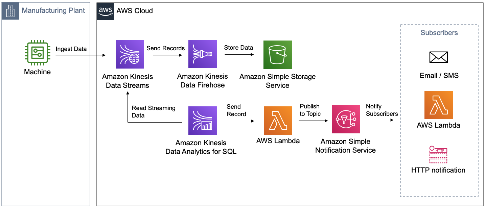

# Amazon Kinesis Analytics Real-time Anomaly Detection

This is the sample code for the German article "Anomalie-Erkennung für Echtzeit-Datenströme" in the BigData Insider Magazine. (Link is following)

When deploying the sample to your own AWS account the following architecture is build:



Services used in this Sample:
- Amazon Kinesis ([Amazon Kinesis Data Streams](https://aws.amazon.com/kinesis/data-streams/), [Amazon Kinesis Data Analytics](https://aws.amazon.com/kinesis/data-analytics/), [Amazon Kinesis Data Firehose](https://aws.amazon.com/kinesis/data-firehose/))
- [AWS Lambda](https://aws.amazon.com/lambda/)
- [Amazon Simple Notification Service (SNS)](https://aws.amazon.com/sns)
- [Amazon EC2](https://aws.amazon.com/ec2) 
- [Amazon Simple Storage Service (S3)](https://aws.amazon.com/s3)

To run the [AWS CloudFormation Stack](https://aws.amazon.com/cloudformation/) in our AWS account click the ``Launch Stack`` Button. This will deploy the sample in the
Europe (Frankfurt) Region. This is currently the only supported region

[](https://console.aws.amazon.com/cloudformation/home?region=eu-central-1#/stacks/new?&templateURL=https://bigdatainsider-anomalydetection-article-fra.s3.eu-central-1.amazonaws.com/anomaly-detection-data-streams.template.json)


If you prefer to deploy it manually, you can clone this repo and use [AWS Cloud Development Kit (CDK)](https://aws.amazon.com/cdk/), with the following commands:
Manually create a virtualenv on MacOS and Linux:

```
$ python3 -m venv .env
```

After the init process completes and the virtualenv is created, you can use the following
step to activate your virtualenv.

```
$ source .env/bin/activate
```

If you are a Windows platform, you would activate the virtualenv like this:

```
% .env\Scripts\activate.bat
```

Once the virtualenv is activated, you can install the required dependencies.

```
$ pip install -r requirements.txt
```

At this point you can now synthesize the CloudFormation template for this code.

```
$ cdk synth
```

To add additional dependencies, for example other CDK libraries, just add
them to your `setup.py` file and rerun the `pip install -r requirements.txt`
command.

You will see in the `cdk.out` folder the generated CloudFormation Template. To deploy it run the following command:

```
$ cdk deploy
```

To see the full documentation on how to start the data producer and the analytics application, checkout the article on BigData Insider.

## License

This library is licensed under the MIT-0 License. See the LICENSE file.